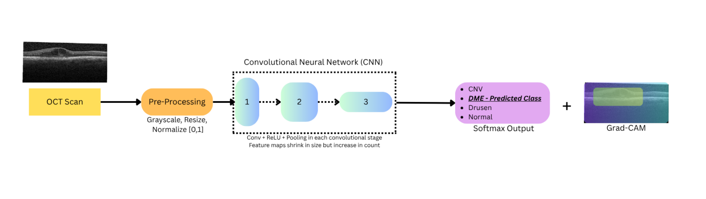
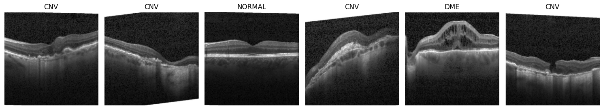
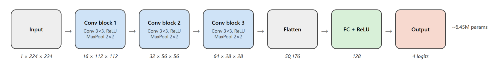
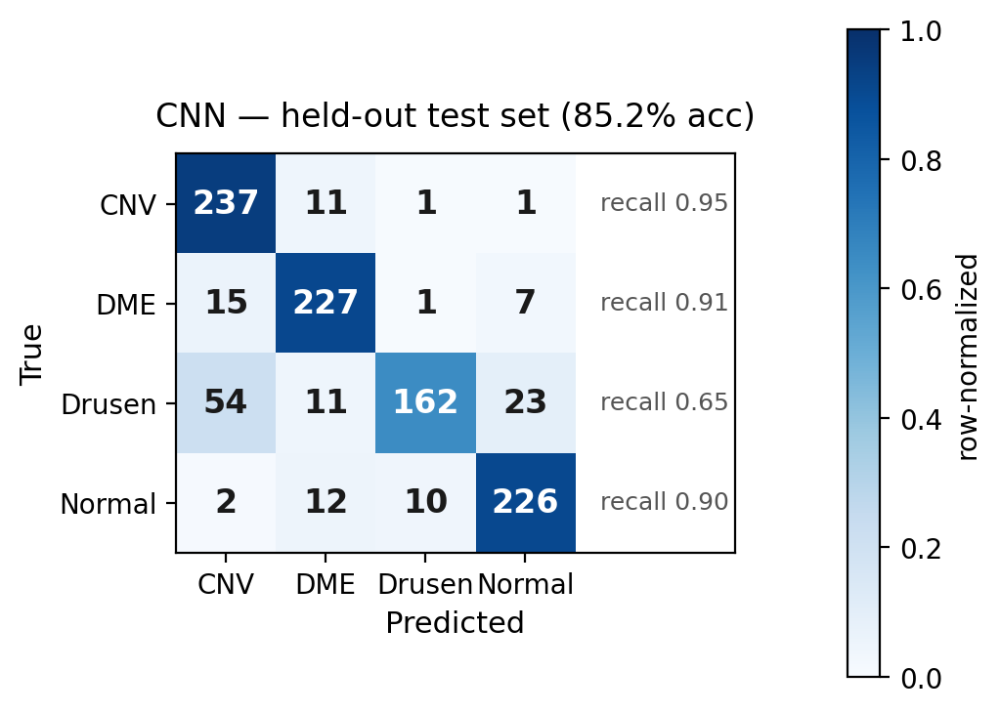
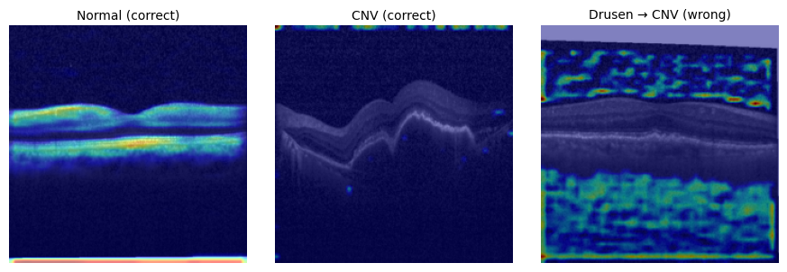

# OCT Scan Disease Detector

A convolutional neural network, **trained from scratch**, that classifies retinal OCT scans into four categories (**CNV, DME, Drusen, and Normal**), then audits *why* it makes each call with Grad-CAM and stress-tests it on a second dataset from a different scanner.

[](https://colab.research.google.com/github/adamsami-62/oct-scan-disease-detector/blob/main/APS360_OCT_Detector.ipynb) &nbsp;·&nbsp; **[Read the full report](OCT_Scan_Disease_Detector_Report.pdf)**



Optical coherence tomography (OCT) is one of the most common retinal imaging procedures, and it's central to catching treatable causes of vision loss early. But reading the huge volume of scans produced in practice depends on scarce specialist time. This project asks how far a small CNN trained from scratch can get on that task, and, just as importantly, whether its predictions are actually driven by clinically meaningful regions of the scan.

---

## Results at a glance

| Model | What it is | Test accuracy |
|---|---|:---:|
| **CNN (from scratch)** | 3 conv blocks, dense layer, 4-way softmax | **85.2%** |
| HOG + SVM baseline | Classical, non-learned features | 75.5% |
| CNN on **OCTDL** (external) | Different scanner, 3-class remap | 74.0% |

The CNN clears the classical baseline by roughly 10 points, and test accuracy matches validation accuracy almost exactly (85.2%), so it generalizes to the held-out set. The ~11-point drop on OCTDL is the honest, informative result, covered below.

---

## Approach

### Data and the patient-level split

The primary dataset is the public [Kermany et al. OCT collection](https://data.mendeley.com/datasets/rscbjbr9sj/3): a training pool of ~108k labeled scans plus a held-out test set of 1,000 (250 per class), left untouched for final evaluation. The classes are heavily imbalanced (Normal and CNV together exceed 80% of the pool; Drusen is ~8%), which is handled during training with a **class-weighted loss**.

The train/validation split is done **at the patient level (~90/10)**, not the image level. Every scan from a given patient lands in exactly one split, so no eye appears in both. This is the detail that makes the accuracy numbers trustworthy: splitting OCT images without respecting patient boundaries lets near-identical scans leak across splits and inflates reported accuracy.

Every image is preprocessed identically: grayscale, resize to 224x224, then scale to `[0, 1]`.



### Baseline: HOG + SVM

To measure how much the *learned* features actually contribute, the CNN is compared against a classical pipeline that learns no features of its own: **Histogram of Oriented Gradients** descriptors feeding a **support-vector machine** with an RBF kernel. Because SVMs scale poorly, it's trained on a balanced subsample (1,500 images/class) and evaluated on the same 1,000-image test set. It reaches **75.5%**, a reasonable floor, with Drusen as its weakest class.

### CNN architecture

Three convolutional blocks (each 3x3 conv, ReLU, 2x2 max-pool) with channels growing 16, 32, 64, then a 128-unit dense layer to a four-way output: about **6.45M parameters**.



Trained with Adam (lr 0.001), class-weighted cross-entropy, batch size 128, and early stopping (patience 3). Preprocessed images are decoded once and cached in memory as `uint8`, which lets training run on the full pool of 98,050 images instead of a subsample. Validation loss bottoms out at epoch 5 (85.2%), after which training accuracy keeps climbing while validation loss rises, a textbook overfitting curve that early stopping halts.

---

## Quantitative results

On the held-out test set the CNN reaches **85.2%**. Per-class recall is uneven: strong on CNV (0.95) and DME (0.91), weakest on **Drusen (0.65)**, most often confused with CNV.



That Drusen/CNV confusion isn't random: drusen and CNV are the **early and advanced stages of the same disease**, so their OCT signatures genuinely overlap, and the same failure shows up in the baseline.

---

## Interpretability: Grad-CAM

Accuracy alone doesn't tell you whether a model is trustworthy, so Grad-CAM is used to see which regions drive each prediction.



On correctly classified **DME** and **Normal** scans, attention tends to fall on plausible retinal structure such as fluid pockets and the retinal layers. But on **CNV** it's inconsistent: even across correct predictions, the highlighted regions drift to the edge or background. And on **Drusen misclassified as CNV**, attention sits on the upper and lower retina rather than the deep retinal-pigment-epithelium region where drusen actually manifest. So while the model reaches useful accuracy, its predictions aren't consistently driven by interpretable features.

---

## External evaluation: OCTDL

The finalized model is evaluated on [OCTDL](https://doi.org/10.1038/s41597-024-03182-7) (1,710 scans, a different scanner and patient population, used in no way during training). Since OCTDL groups drusen and neovascular cases under a single **AMD** label, the model's CNV and Drusen predictions are merged into AMD, giving a three-class problem.

Accuracy falls to **74.0%**. AMD transfers well (recall 0.87), but Normal scans are frequently read as DME (recall 0.34). The takeaway: the model captures the broad AMD category, but it also leans on **scanner-specific texture** that doesn't survive a change of hardware, an unsurprising limitation for a from-scratch model trained on a single source.

---

## What I'd take from this

- **The model is strong on its source data but not yet deployment-ready.** 85.2% comfortably beats the baseline, but the OCTDL drop shows it learned genuine disease structure *alongside* scanner-specific texture.
- **The hardest error is clinically grounded.** The Drusen/CNV confusion mirrors the disease itself, and it appears in both the baseline and the CNN.
- **Interpretability is a real caveat, not a footnote.** Grad-CAM shows the attention is often not localized to the lesion, so accuracy overstates how "for the right reasons" the model is.
- **Next steps** that would most likely move the needle: transfer learning from an ImageNet backbone (the dominant approach on this dataset), light augmentation to reduce scanner overfitting, and multi-source training.

---

## Repository structure

```
.
├── APS360_OCT_Detector.ipynb          full pipeline: data, baseline, CNN, Grad-CAM, OCTDL
├── OCT_Scan_Disease_Detector_Report.pdf
├── assets/                            figures used in this README
├── requirements.txt
└── README.md
```

## Running it

The notebook is built for **Google Colab with a GPU**.

1. Open `APS360_OCT_Detector.ipynb` in Colab (badge at the top).
2. Download the datasets, [Kermany OCT](https://data.mendeley.com/datasets/rscbjbr9sj/3) and, for the external test, [OCTDL](https://doi.org/10.1038/s41597-024-03182-7), and place them in your Drive.
3. Edit the **config cell** at the top (`DRIVE_ROOT`, `OCTDL_ROOT`) to point at your own paths. Every other path is derived from those two, so that's the only edit needed.
4. Run top to bottom. The first pass caches the preprocessed tensors to Drive; later sessions can use the *fast restart* cell to skip straight past preprocessing.

Dependencies are listed in `requirements.txt` (all preinstalled on Colab).

## References

Datasets and methods are cited in full in the [report](OCT_Scan_Disease_Detector_Report.pdf). Core sources: Kermany et al. (2018) for the OCT dataset, Kulyabin et al. (2024) for OCTDL, and Selvaraju et al. (2017) for Grad-CAM.
